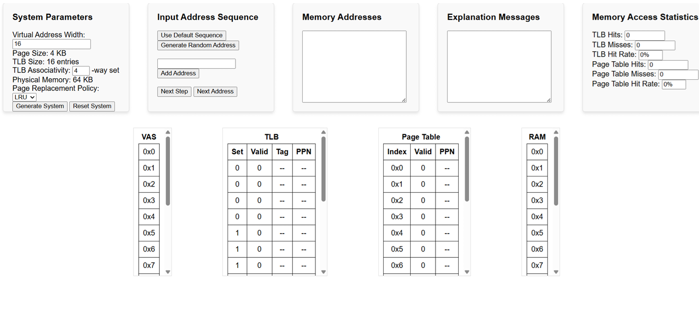
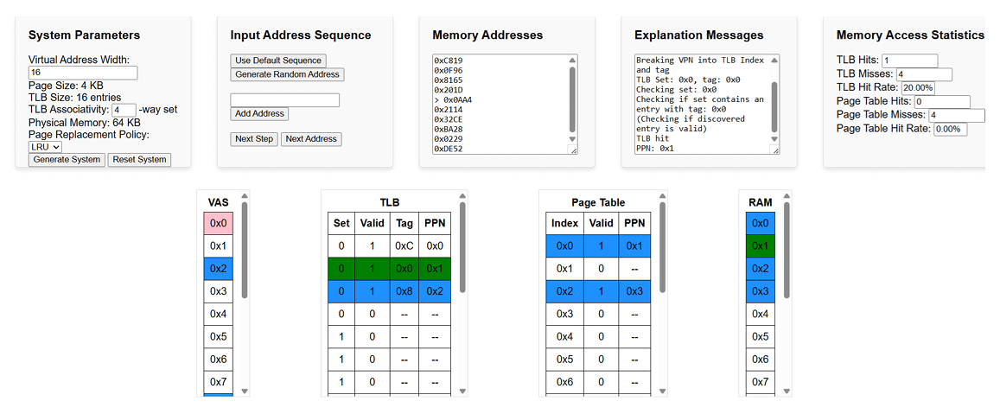

# Memory Management Simulator  

## Overview  
This project is a **Memory Management Simulator** that allows users to experiment with different memory management parameters and observe their impact on system performance. The web-based tool provides interactive visualization, performance metrics, and step-by-step execution of memory access patterns.  

## Features  

### **1. Memory Configuration**  
Users can modify key memory settings:  
- **Physical Memory Size:** Adjust the size of physical memory to observe performance changes.  
- **Virtual Address Space (VAS) Size:** Configure the virtual memory size (must be a power of 2). Page size is fixed at 4 KB.  
- **Page Replacement Policy:** Choose between **FIFO** (First-In-First-Out) and **LRU** (Least Recently Used).  

### **2. Address Sequence Input**  
Users can manually enter memory addresses or generate random sequences to test different memory access patterns.  

### **3. Performance Metrics**  
The simulator provides real-time insights into:  
- **Page Table Statistics:** Tracks page hits and misses.  
- **TLB Statistics:** Shows cache efficiency with TLB hits and misses.  

### **4. Step-by-Step Visualization**  
The system highlights each memory access with color-coded entries:  
- **Pink:** Currently accessed Virtual Page Number (VPN).  
- **Red/Green:** TLB or PT hits (green) and misses (red).  
- **Blue:** Already occupied entries.  
- **Gray:** Evicted pages or invalid TLB entries.  
- **Green:** Pages successfully loaded into RAM.  

### **5. Web Interface**  
- Displays tables for **VAS, Page Table, RAM, and TLB**.  
- Uses JavaScript and REST API to dynamically update data without refreshing the page.  

#### Images  
1. **Initial Web App Setup:** Shows the configuration interface. 
 
2. **Memory Access Execution:** Captures the simulation during an execution step.  
 

## Classes and Core Components  

- **PageTable:** Manages virtual-to-physical frame mappings.  
- **TLBEntry:** Represents an entry in the **Translation Lookaside Buffer (TLB)**.  
- **TLB:** Manages TLB lookups for faster memory access.  
- **PageReplacementPolicy (interface):** Defines the eviction strategy.  
  - **FIFOPageReplacementPolicy:** Evicts the oldest page first.  
  - **LRUPageReplacementPolicy:** Evicts the least recently used page.  
- **Simulator:** Coordinates all components, updates the UI, and processes memory accesses.  

## Conclusion
This application is ideal for students and professionals looking to better understand virtual memory, page replacement, and TLB behavior in a computer system.
